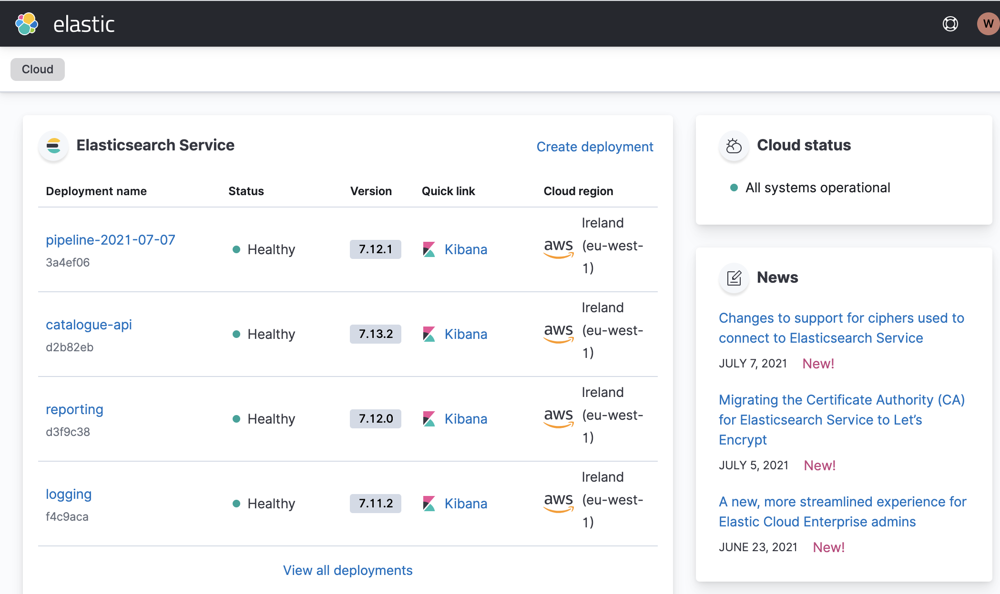
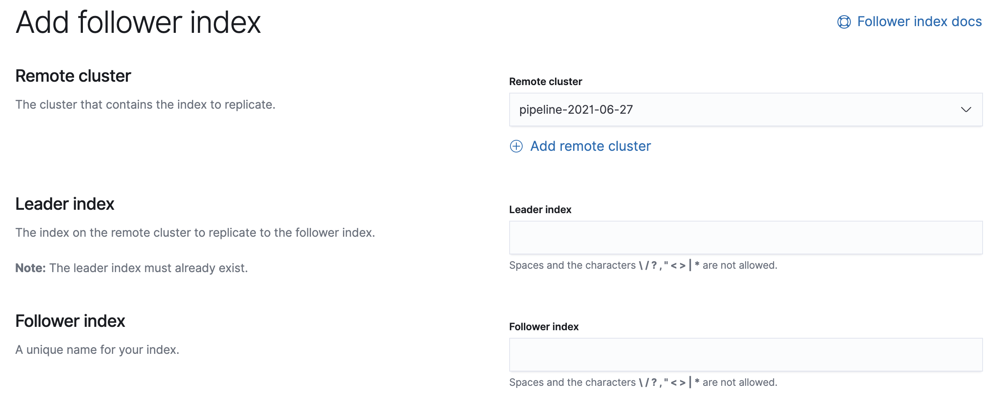

# Reindexing

A reindex operation runs the source data from the [adapters](docs/adapters/README.md) through the pipeline causing it to be re-transformed / matched & merged as appropriate.

## How to run a reindex

Running a reindex will require:

- Preparing and deploying a release
- Terraforming a new pipeline using that release
- Running the reindex script to feed the new pipeline

### Update the catalogue-pipeline environments

The catalogue-pipeline is deployed using [weco-deploy](https://github.com/wellcomecollection/weco-deploy) but does not deploy in the usual way as there is often one release per pipeline. 

Each environment will represent a new release.

In `.wellcome_project`:

```
catalogue_pipeline:
  environments:
    - id: "2021-06-27"
      name: "2021-06-27"
    - id: "2021-07-06"
      name: "2021-07-06"
    - id: "MY-NEW-PIPELINE"
      name: "MY-NEW-PIPELINE"
```

Name your new pipeline environment using the date pattern indicated above. You will need to use the environment label when terraforming a new pipeline.

### Prepare a release

Prepare a release following the example below. You may want to choose a specific git ref as a label and _not_ latest.

```
> weco-deploy --project-id catalogue_pipeline prepare --from-label latest --description "A helpful description"

Prepared release from images in latest
Requested by: arn:aws:sts::760097843905:assumed-role/platform-superdev/KennyR@Wellcomecloud.onmicrosoft.com
Date created: 2021-07-08T15:11:48.403652

service                old image    new image    Git commit
---------------------  -----------  -----------  ------------
aspect_ratio_inferrer  efd451f      -            -
batcher                532ddee      -            -
feature_inferrer       efd451f      -            -
id_minter              021df38      -            -
inference_manager      021df38      -            -
ingestor_images        021df38      -            -
ingestor_works         021df38      -            -
matcher                021df38      -            -
merger                 021df38      -            -
palette_inferrer       efd451f      -            -
relation_embedder      021df38      -            -
router                 021df38      -            -
transformer_calm       021df38      -            -
transformer_mets       021df38      -            -
transformer_miro       021df38      -            -
transformer_sierra     021df38      -            -
transformer_tei        f9f910d      -            -

Created release eeb9482f-0a6a-4211-8de9-27cee7567134
```

### Deploy a release

Using the release identifier gathered from preparing the release and the environment identifier added to `.wellcome-project` you can now perform a deploy operation:

```
> weco-deploy --project-id catalogue_pipeline deploy \
  --release-id eeb9482f-0a6a-4211-8de9-27cee7567134 \
  --environment-id EXAMPLE-PIPELINE \
  --description "A helpful description"

Deploying release eeb9482f-0a6a-4211-8de9-27cee7567134
Targeting env: EXAMPLE-PIPELINE (Environment(id='EXAMPLE-PIPELINE', name='EXAMPLE-PIPELINE'))
Requested by: arn:aws:sts::760097843905:assumed-role/platform-superdev/KennyR@Wellcomecloud.onmicrosoft.com
Date created: 2021-07-08T15:11:48.403652

ECS services discovered:

image ID               services
---------------------  ----------
aspect_ratio_inferrer
batcher
feature_inferrer
id_minter
inference_manager
ingestor_images
ingestor_works
matcher
merger
palette_inferrer
relation_embedder
router
transformer_calm
transformer_mets
transformer_miro
transformer_sierra
transformer_tei

Create deployment? [y/N]: y

Deployment Summary
Requested by: arn:aws:sts::760097843905:assumed-role/platform-superdev/KennyR@Wellcomecloud.onmicrosoft.com
Date created: 2021-07-08T15:23:55.267305
Deploy data:  /Users/robertkenny/.local/share/weco-deploy/deployment_results/deploy_2021-07-08_16-23-55.json

image ID               summary of changes
---------------------  --------------------
aspect_ratio_inferrer  ECR tag updated,
batcher                ECR tag updated,
feature_inferrer       ECR tag updated,
id_minter              ECR tag updated,
inference_manager      ECR tag updated,
ingestor_images        ECR tag updated,
ingestor_works         ECR tag updated,
matcher                ECR tag updated,
merger                 ECR tag updated,
palette_inferrer       ECR tag updated,
relation_embedder      ECR tag updated,
router                 ECR tag updated,
transformer_calm       ECR tag updated,
transformer_mets       ECR tag updated,
transformer_miro       ECR tag updated,
transformer_sierra     ECR tag updated,
transformer_tei        ECR tag updated,

Deployed release eeb9482f-0a6a-4211-8de9-27cee7567134 to EXAMPLE-PIPELINE (Environment(id='EXAMPLE-PIPELINE', name='EXAMPLE-PIPELINE'))

Checking deployment of eeb9482f-0a6a-4211-8de9-27cee7567134 to EXAMPLE-PIPELINE
Allowing 600s for deployment.

Deployment of eeb9482f-0a6a-4211-8de9-27cee7567134 to EXAMPLE-PIPELINE successful
Deployment took 2s
```

This operation **only tags ECR images with the new environment** it does not deploy any services. 

This will be done when you terraform a new pipeline.

### Terraform a new pipeline

You will now need to create a new pipeline module in [./pipeline/terraform/main.tf](./pipeline/terraform/main.tf).

Copy and paste an exisiting pipeline making sure to update the fields:

- `pipeline_date`: References secrets required to access ES and to sets internal infrastructure labels.
- `release_label`: Sets the ECR label to use on the service deployment images, created in the above deployment process. 
- `is_reindexing`: Sets ES cluster/service scaling limits while reindexing, and connects reindexing topics. Enabling this will incur above normal costs for a pipeline.

See the following example:

```tf
module "catalogue_pipeline_2021-07-06" {
  source = "./stack"

  pipeline_date = "2021-07-06"
  release_label = "2021-07-06"

  is_reindexing = false

  # Boilerplate that shouldn't change between pipelines.
  # ...
}

module "catalogue_pipeline_MY-NEW-PIPELINE" {
  source = "./stack"

  pipeline_date = "MY-NEW-PIPELINE"
  release_label = "MY-NEW-PIPELINE"

  is_reindexing = true

  # Boilerplate that shouldn't change between pipelines.
  # ...
}
```

### Running the reindex script

Now we have our pipeline connected for reindexing and running our chosen version of the pipeline code we can start a reindex operation.

The reindex script can be found in [./reindexer/start_reindex.py](./reindexer/start_reindex.py).

```
> python3 ./start_reindex.py

Which source do you want to reindex? (all, miro, sierra, mets, calm): all
Which pipeline are you sending this to? (catalogue, catalogue_miro_updates, reporting): catalogue
Every record (complete), just a few (partial), or specific records (specific)? (complete, partial, specific): partial
```

You may wish to run a partial-reindex to verify that the process will work as expected before embarking on a complete reindex.

You can monitor a reindex in progress using Grafana at [https://monitoring.wellcomecollection.org/](https://monitoring.wellcomecollection.org/), or by looking at CloudWatch metrics in the `platform` AWS account.

Non-empty DLQs will be reported in the Wellcome #wc-platform-alerts Slack channel.

A reindex should take less than a working day to complete. 

### Connecting the Catalogue API

When we have a new index in the Elasticsearch cluster created for the pipeline when we terraformed it, we will want to make that index available to the Catalogue API cluster.

#### Following an index

We replicate indexes between pipeline and catalogue-api clusters using [Elasticsearch CCR](https://www.elastic.co/guide/en/elasticsearch/reference/current/xpack-ccr.html).

To follow an index using the console:

- You can sign into Elastic Cloud here: https://cloud.elastic.co/home

  Your cluster will be created in Elastic Cloud with a name patterned after : `pipeline-MY-NEW-PIPELINE`.

  

- The catalogue-api cluster [stack-management CCR options](https://catalogue-api.kb.eu-west-1.aws.found.io:9243/app/management/data/cross_cluster_replication/follower_indices) are available via Kibana for that cluster.

  You will be able to [create a follower index](https://catalogue-api.kb.eu-west-1.aws.found.io:9243/app/management/data/cross_cluster_replication/follower_indices/add)

  

  - Pick the remote cluster created by terraform above.
  - Create the follower indexes using the naming pattern:
  
    - `works-indexed-MY-NEW-PIPELINE`
    - `images-indexed-MY-NEW-PIPELINE`
  
  Be sure to create follower indexes for both images & works indexes. You should name the follower indexes the same as their leader. 
  
#### Updating configuration 

When you have a complete successful reindex you will want to present it via the Catalogue API.

A new index can be referenced by updating the [`ElasticConfig` object](https://github.com/wellcomecollection/catalogue-api/blob/main/common/display/src/main/scala/weco/catalogue/display_model/ElasticConfig.scala#L15):

The `indexDate` should be the one used to reference the deployment and terraformed pipeline:

```scala
object ElasticConfig {
  // We use this to share config across API applications
  // i.e. The API and the snapshot generator.
  val indexDate = "MY-NEW-PIPELINE"

  def apply(): ElasticConfig =
    ElasticConfig(
      worksIndex = Index(s"works-indexed-$indexDate"),
      imagesIndex = Index(s"images-indexed-$indexDate")
    )
}
```

You will want to deploy this change through the API stage environment and allow CI to perform the usual API checks. 

Be sure to check the diff_tool output in CI before deploying to production!


