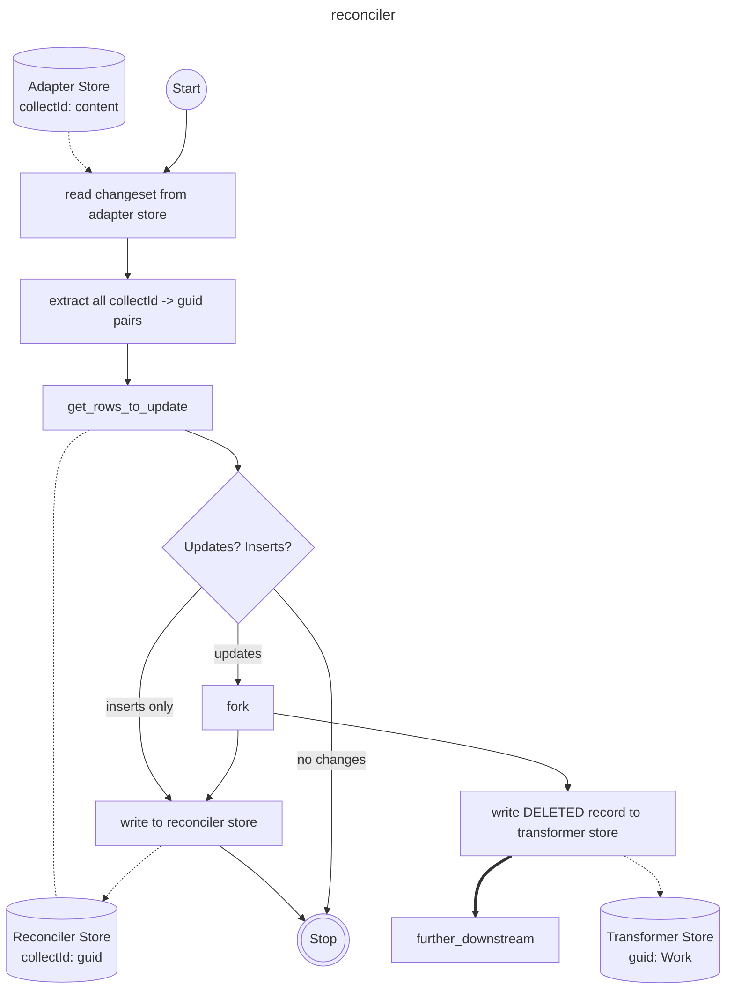

# Transformers

This module transforms adapter data (stored in Iceberg tables) into `SourceWork` documents and indexes them into
Elasticsearch.

## Overview

The transformer pipeline consists of:

1. **Data Source**: Reads records from an Iceberg adapter store (via `AdapterStoreSource`)
2. **MARC XML Parsing**: Parses MARCXML content into pymarc `Record` objects
3. **Transformation**: Converts MARC records into `SourceWork` models (visible, invisible, or deleted)
4. **Indexing**: Bulk indexes transformed documents into Elasticsearch

### Architecture

```
┌─────────────────┐    ┌──────────────────────┐    ┌─────────────────┐    ┌───────────────┐
│  Iceberg Table  │───▶│  MarcXmlTransformer  │───▶│   SourceWork    │───▶│ Elasticsearch │
│  (Adapter Store)│    │  (Axiell or EBSCO)   │    │   Documents     │    │    Index      │
└─────────────────┘    └──────────────────────┘    └─────────────────┘    └───────────────┘
```

### Transformer Types

- **`AxiellTransformer`**: Transforms Axiell/Mimsy records into `InvisibleSourceWork` documents
- **`EbscoTransformer`**: Transforms EBSCO serial records into `VisibleSourceWork` documents
- **`AxiellReconciler`**: A special Axiell transformer emitting `DeletedSourceWork` documents.
  See [Axiell reconciler](#axiell-reconciler) section for more information

Both inherit from `MarcXmlTransformer`, which handles common MARC parsing and deleted record handling.

## Running the Transformer

### Prerequisites

1. Ensure you're in the `catalogue_graph` directory
2. Have UV installed and configured
3. For remote data access, set the appropriate AWS profile

### Environment Variables

When running locally, set `PIPELINE_DATE` to match the target pipeline date (e.g. `2024-10-30`). This controls which
Elasticsearch credentials are used and the index naming. **If not set, it defaults to `dev`, which is incorrect for
production runs.**

```bash
export PIPELINE_DATE=2024-10-30
```

See the adapter config files (`adapters/axiell/config.py`, `adapters/ebsco/config.py`) for other configurable
environment variables.

### Local Development (with local Elasticsearch)

Transform records from a specific changeset using a local Iceberg table and local Elasticsearch:

```bash
cd catalogue_graph

# Transform Axiell records
uv run python -m adapters.steps.transformer \
  --transformer-type axiell \
  --changeset-id <changeset-id> \
  --job-id dev \
  --es-mode local

# Transform EBSCO records  
uv run python -m adapters.steps.transformer \
  --transformer-type ebsco \
  --changeset-id <changeset-id> \
  --job-id dev \
  --es-mode local
```

### Using Remote S3 Tables

To read from the production S3 Tables catalog:

```bash
cd catalogue_graph

AWS_PROFILE=platform-developer uv run python -m adapters.steps.transformer \
  --transformer-type axiell \
  --changeset-id <changeset-id> \
  --job-id my-job-123 \
  --use-rest-api-table \
  --es-mode local
```

### Full Reindex (no changeset)

Omit `--changeset-id` to reindex all records in the adapter store:

```bash
cd catalogue_graph

uv run python -m adapters.steps.transformer \
  --transformer-type ebsco \
  --job-id full-reindex \
  --es-mode local \
  --create-if-not-exists
```

### Indexing to Production Elasticsearch

Use `--es-mode public` to index to the production cluster (requires appropriate credentials):

```bash
cd catalogue_graph

AWS_PROFILE=platform-developer uv run python -m adapters.steps.transformer \
  --transformer-type ebsco \
  --changeset-id <changeset-id> \
  --job-id prod-run-001 \
  --use-rest-api-table \
  --es-mode public
```

## CLI Arguments

| Argument                 | Required | Description                                                                                                                               |
|--------------------------|----------|-------------------------------------------------------------------------------------------------------------------------------------------|
| `--transformer-type`     | Yes      | Which transformer to run: `axiell`, `ebsco`, or `axiell_reconciler`                                                                       |
| `--changeset-id`         | No       | Changeset ID to transform. Can be repeated for multiple changesets. If omitted, transforms all records. Required for `axiell_reconciler`. |
| `--job-id`               | No       | Job identifier for manifest tracking. Defaults to `dev`.                                                                                  |
| `--use-rest-api-table`   | No       | Use the S3 Tables catalog instead of local storage.                                                                                       |
| `--es-mode`              | No       | Elasticsearch target: `local` (default) or `public`.                                                                                      |
| `--create-if-not-exists` | No       | Create the Iceberg table if it does not already exist.                                                                                    |

## Lambda Invocation

In production, the transformer runs as a Lambda function. The event structure:

```json
{
  "transformer_type": "ebsco",
  "job_id": "batch-20250116",
  "changeset_ids": [
    "changeset-001",
    "changeset-002"
  ]
}
```

## Output

The transformer produces:

- **Elasticsearch documents**: Indexed into the configured source works index
- **Manifest file**: Written to S3 with lists of successful IDs and any errors

## Error Handling

- Parse errors (invalid MARCXML) are logged and recorded in the manifest
- Transform errors are captured with the work ID and error details
- Elasticsearch bulk indexing errors are tracked per-document
- Up to 1,000 errors are recorded in each manifest to cap file sizes

## Axiell reconciler

The reconciler is a special Axiell transformer which only transforms deleted works. It exists to mitigate the fact that
primary Axiell identifiers (collectIds) are reusable in the source system. For example, if some identifier `collectId1`
is assigned to some work `A` and the work gets deleted, `collectId1` can get reassigned to another work `B`. This means
we can't reliably use collectIds to determine if a given work has been deleted.

The solution involves keeping an Iceberg table (called the reconciler store) mapping collectIds to secondary
non-reusable GUIDs (stored in the content of each work). The reconciler updates the table after each adapter run,
detects all cases where a given collectId is reassigned from an old GUID to a new one, and emits the old GUID
as a deleted work.


