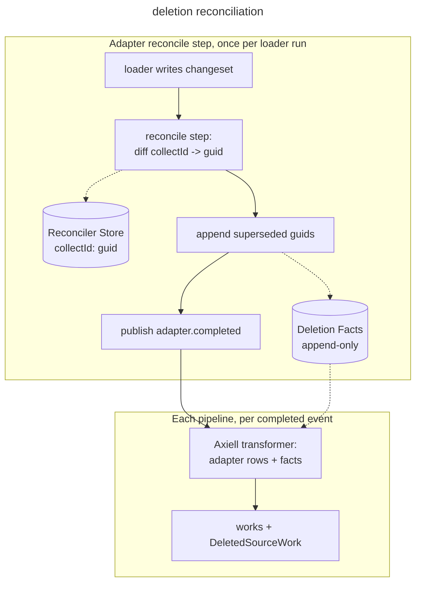

# Transformers

This module transforms adapter data (stored in Iceberg tables) into `SourceWork` documents and indexes them into
Elasticsearch.

## Overview

The transformer pipeline consists of:

1. **Data Source**: Reads records from an Iceberg adapter store (via `AdapterStoreSource`)
2. **MARC XML Parsing**: Parses MARCXML content into pymarc `Record` objects
3. **Transformation**: Converts MARC records into `SourceWork` models (visible, invisible, or deleted)
4. **Indexing**: Bulk indexes transformed documents into Elasticsearch

### Architecture

```
┌─────────────────┐    ┌────────────────────────┐    ┌─────────────────┐    ┌───────────────┐
│  Iceberg Table  │───▶│  MarcXmlTransformer    │───▶│   SourceWork    │───▶│ Elasticsearch │
│  (Adapter Store)│    │  (Axiell/EBSCO/FOLIO)  │    │   Documents     │    │    Index      │
└─────────────────┘    └────────────────────────┘    └─────────────────┘    └───────────────┘
```

### Transformer Types

- **`AxiellTransformer`**: Transforms Axiell/Mimsy records into `InvisibleSourceWork` documents, and delivers
  guid-change deletions recorded by the adapter-side reconcile step. See
  [Axiell deletion reconciliation](#axiell-deletion-reconciliation) for more information
- **`EbscoTransformer`**: Transforms EBSCO serial records into `VisibleSourceWork` documents
- **`FolioTransformer`**: Transforms FOLIO instance records into `VisibleSourceWork` documents, joining a second
  Iceberg store to attach items. See [FOLIO item enrichment](#folio-item-enrichment) section for more information

All inherit from `MarcXmlTransformer`, which handles common MARC parsing and deleted record handling.

Note: the Axiell to FOLIO *sync* (which writes Axiell records out to FOLIO Inventory rather than into Elasticsearch)
is not a transformer; it lives in [`adapters/steps/axiell_folio_sync`](../steps/axiell_folio_sync/README.md).

## Running the Transformer

### Prerequisites

1. Ensure you're in the `catalogue_graph` directory
2. Have UV installed and configured
3. For remote data access, set the appropriate AWS profile

### Environment Variables

When running locally, set `PIPELINE_DATE` to match the target pipeline date (e.g. `2024-10-30`). This controls which
Elasticsearch credentials are used and the index naming. **If not set, it defaults to `dev`, which is incorrect for
production runs.**

```bash
export PIPELINE_DATE=2024-10-30
```

See the adapter config files (`adapters/axiell/config.py`, `adapters/ebsco/config.py`) for other configurable
environment variables.

### Local Development (with local Elasticsearch)

Transform records from a specific changeset using a local Iceberg table and local Elasticsearch:

```bash
cd catalogue_graph

# Transform Axiell records
uv run python -m adapters.steps.transformer \
  --transformer-type axiell \
  --changeset-id <changeset-id> \
  --job-id dev \
  --es-mode local

# Transform EBSCO records  
uv run python -m adapters.steps.transformer \
  --transformer-type ebsco \
  --changeset-id <changeset-id> \
  --job-id dev \
  --es-mode local
```

### Using Remote S3 Tables

To read from the production S3 Tables catalog:

```bash
cd catalogue_graph

AWS_PROFILE=platform-developer uv run python -m adapters.steps.transformer \
  --transformer-type axiell \
  --changeset-id <changeset-id> \
  --job-id my-job-123 \
  --use-rest-api-table \
  --es-mode local
```

### Full Reindex (no changeset)

Omit `--changeset-id` to reindex all records in the adapter store:

```bash
cd catalogue_graph

uv run python -m adapters.steps.transformer \
  --transformer-type ebsco \
  --job-id full-reindex \
  --es-mode local \
  --create-if-not-exists
```

### Indexing to Production Elasticsearch

Use `--es-mode public` to index to the production cluster (requires appropriate credentials):

```bash
cd catalogue_graph

AWS_PROFILE=platform-developer uv run python -m adapters.steps.transformer \
  --transformer-type ebsco \
  --changeset-id <changeset-id> \
  --job-id prod-run-001 \
  --use-rest-api-table \
  --es-mode public
```

## CLI Arguments

| Argument                 | Required | Description                                                                                                                               |
|--------------------------|----------|-------------------------------------------------------------------------------------------------------------------------------------------|
| `--transformer-type`     | Yes      | Which transformer to run: `axiell`, `ebsco`, or `folio`                                                                                   |
| `--changeset-id`         | No       | Changeset ID to transform. Can be repeated for multiple changesets. If omitted, transforms all records.                                   |
| `--job-id`               | No       | Job identifier for manifest tracking. Defaults to `dev`.                                                                                  |
| `--use-rest-api-table`   | No       | Use the S3 Tables catalog instead of local storage.                                                                                       |
| `--es-mode`              | No       | Elasticsearch target: `local` (default) or `public`.                                                                                      |
| `--create-if-not-exists` | No       | Create the Iceberg table if it does not already exist.                                                                                    |

## Lambda Invocation

In production, the transformer runs as a Lambda function. The event structure:

```json
{
  "transformer_type": "ebsco",
  "job_id": "batch-20250116",
  "changeset_ids": [
    "changeset-001",
    "changeset-002"
  ]
}
```

## Output

The transformer produces:

- **Elasticsearch documents**: Indexed into the configured source works index
- **Manifest file**: Written to S3 with lists of successful IDs and any errors

## Error Handling

- Parse errors (invalid MARCXML) are logged and recorded in the manifest
- Transform errors are captured with the work ID and error details
- Elasticsearch bulk indexing errors are tracked per-document
- Up to 1,000 errors are recorded in each manifest to cap file sizes

## Axiell deletion reconciliation

Primary Axiell identifiers (collectIds) are reusable in the source system: if `collectId1` is assigned to some
work `A` and the record gets deleted, `collectId1` can be reassigned to a new work `B`. This means collectIds
alone can't tell us when a work has been deleted, so each work also carries a non-reusable GUID (MARC 001).

Reconciliation is split between the adapter and the transformer:

- **Detection** happens once, in the adapter state machine (`adapters.steps.oai_pmh.reconcile`), between the
  loader and the completed event. The step diffs each changeset's collectId -> GUID mappings against the
  reconciler store; when a collectId has moved to a new GUID it appends a row to the append-only deletion
  facts table (tagged with the triggering changeset id) before committing the updated mappings.
- **Delivery** is stateless and happens in every pipeline's Axiell transformer: `AxiellStoreSource` streams
  deletion facts for the run's changeset ids after the adapter rows, and each fact is emitted as a
  `DeletedSourceWork` for its superseded GUID. A fact whose GUID is an active mapping again (a revert, or a
  redrive of an old changeset) is skipped, so a stale fact can never tombstone a live work.

Because detection writes durable facts rather than emitting deletions directly, any number of pipeline stacks
can deliver the same deletion independently. Consumers read through
`adapters.utils.axiell_changeset_reader.AxiellChangesetReader`, which owns the store wiring and the liveness
check. The transformer consumes both streams; the Axiell to FOLIO sync reads records through the reader today
and adopts `iter_deletions()` with platform#6440.

If indexing a tombstone fails, the error lands in the transformer report and fires the per-pipeline
transformer-failures alarm, but the execution still succeeds. Facts are only read by runs for their original
changeset ids, so recovery is a manual redrive: re-run the transformer for that pipeline with the failed run's
changeset ids (idempotent, safe to repeat).


```mermaid
---
title: deletion reconciliation
---
flowchart TD
    subgraph adapter["Adapter reconcile step, once per loader run"]
        loader["loader writes changeset"] --> reconcile["reconcile step:<br/>diff collectId -> guid"]
        reconciler_store[(Reconciler Store<br/>collectId: guid)]
        reconcile -.-> reconciler_store
        reconcile --> facts["append superseded guids"]
        facts_table[(Deletion Facts<br/>append-only)]
        facts -.-> facts_table
        facts --> publish["publish adapter.completed"]
    end
    subgraph pipeline["Each pipeline, per completed event"]
        transform["Axiell transformer:<br/>adapter rows + facts"] --> works["works + DeletedSourceWork"]
    end
    publish --> transform
    facts_table -.-> transform
```

## FOLIO item enrichment

The FOLIO transformer differs from the others in that it reads *two* Iceberg tables. The FOLIO OAI-PMH bib record
carries no item UUIDs, so a separate enrichment step (`adapters.steps.oai_pmh.folio_enrich`, running between the
loader and the publish event) maintains an items store keyed by instance id. At transform time `FolioStoreSource`
joins that store onto each bib row (in bounded batches, attached as `enrichment_content`), and `FolioWorkBuilder`
emits items carrying a `folio-item` source identifier with the inventory UUID.

Transformer-side behaviour to be aware of:

- The items table must exist: a missing table fails the transform (`NoSuchTableError`) rather than silently emitting
  works without items. On a fresh environment, run one enrichment pass before transforming.
- An instance that has not been enriched emits no items; the transformer never guesses item identity from MARC 952.
- Transformation never calls FOLIO. A full reindex joins whatever is already in the items store.

See [Item enrichment](../extractors/oai_pmh/folio/README.md#item-enrichment) in the FOLIO adapter README for the full
design, including how the items store is populated and kept current.
