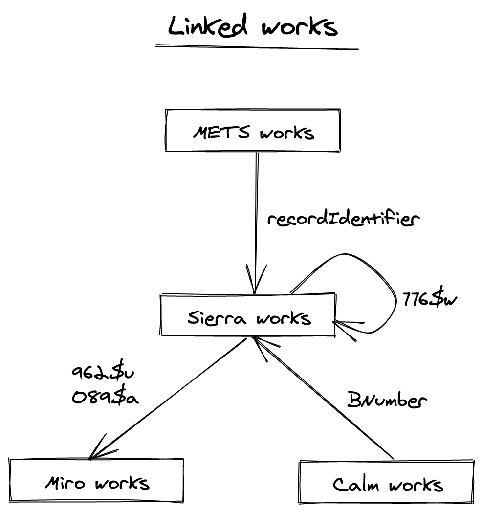

# Merging

## The process
Merging works is split up into 2 steps:

### 1. Linking works

Using features from the source data to calculate which works are linked.

e.g:
* the `BNumber` from a Calm record
* Marcfield `776$w` linking a Sierra record to it's digitised counterpart

This is carried out by the transformers of the respective sources data.

#### How are works currently linked?

https://excalidraw.com/#json=5964037271584768,ojtCECzrMrgSJuBp3VCvHw

### 2. Merging linked works
TBD.

