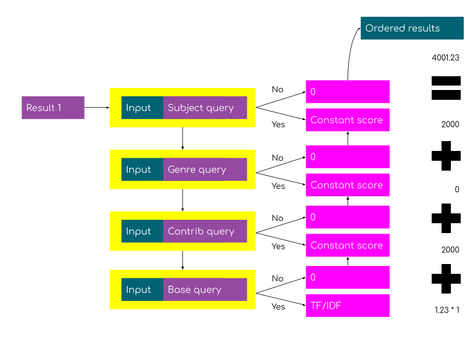

# Test 7 - BoolBoosted vs ConstScore

## Candidates

Currently the matches on different features of the data are wrapped in [`const_score` compound queries](https://www.elastic.co/guide/en/elasticsearch/reference/current/query-dsl-constant-score-query.html).

This is good for prioritising between matches on different features of the data but then loses nuance within that match.

e.g. `Grey's` matches the title `Grey's anatomy` and `Grey's Hospital` thus the matching query will assign a score for that tier of a constant to both e.g. 2000.

While this is useful to say we would like to have contributor matches higher that title matches, we still want to reflect nuance within that match.

To do this we wrap the tiers in a `bool` query and boost each tier respectively.

### `ConstScore`

### `BoolBoosted`

## Results

### Click through rate

|  | ConstScore | BoolBoosted |
| :--- | :--- | :--- |
| first page only | TBD | TBD |
| beyond first page | TBD | TBD |

### Click distribution

TBD

## Conclusions

TBD

