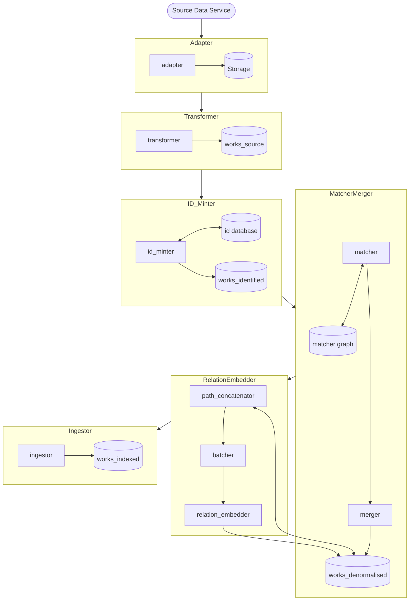

# The pipeline

## The Works pipeline

How this all fits together

Individual stages:
* [CALM adapter](../calm_adapter/README.md)
* [EBSCO adapter](../ebsco_adapter/README.md)
* [METS adapter](../mets_adapter/README.md)
* [SIERRA adapter](../sierra_adapter/README.md)
* [TEI adapter](../tei_adapter/README.md)
* [transformers](./transformer/)
* [id_minter](./id_minter/README.md)
* [matcher](./matcher_merger/matcher/README.md)
* [merger](./matcher_merger/merger/README.md)
* [path_concatenator](./relation_embedder/path_concatenator/README.md)
* [batcher](./relation_embedder/batcher/README.md)
* [relation_embedder](./relation_embedder/relation_embedder/README.md)
* [ingestor](./ingestor/)

