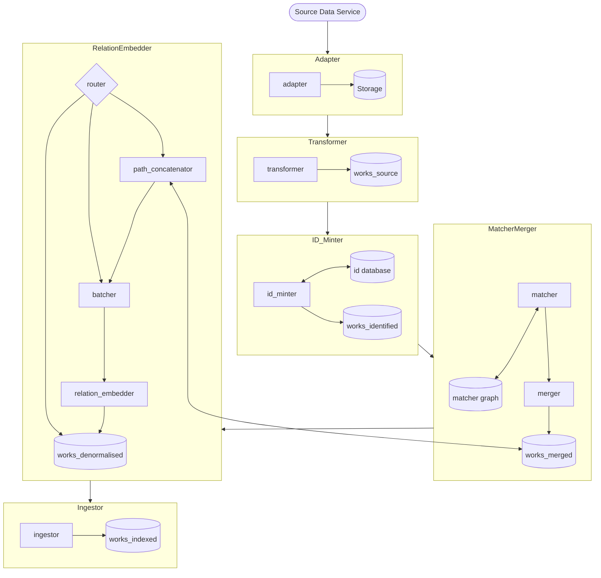

# The pipeline

## The Works pipeline

How this all fits together

See individual stages for more detail:
* [matcher](./matcher/README.md)
* [merger](./merger/README.md)
* [path_concatenator](./relation_embedder/path_concatenator/README.md)

