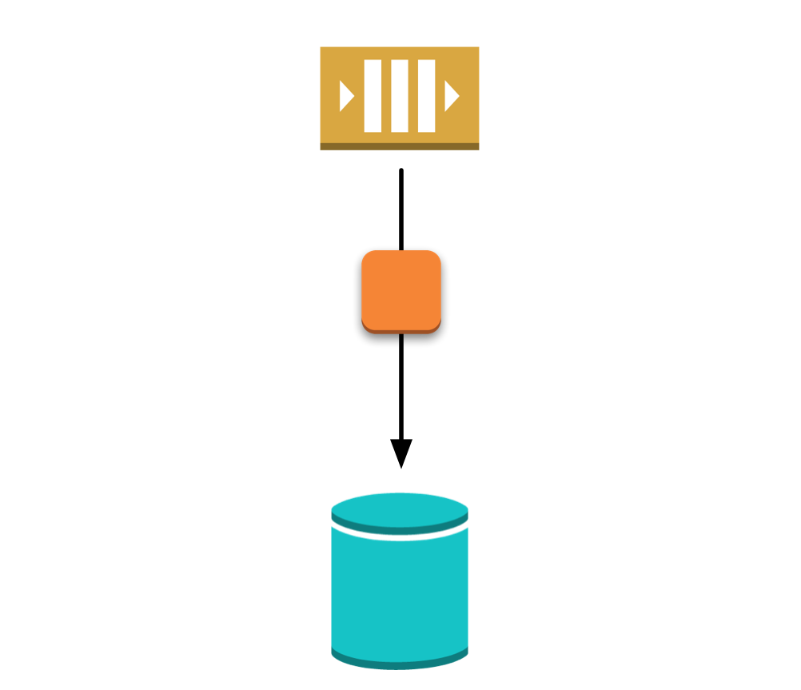

# Pipeline

Our ingest pipeline is made up of a number of steps, which are illustrated below. Each orange box is one of our applications.

| .png>)         | 
We have a series of data sources (for now, catalogue data from Calm and image data from Miro, but we'll add others). Each presents data in a different format, or with a different API.

Each data source has an <strong>adapter</strong> that sits in front of it, and knows how to extract data from its APIs. The adapter copies the complete contents of the original data source into a DynamoDB table, one table per data source.
                         |
| -------------------------------------------------- | --------------------------------------------------------------------------------------------------------------------------------------------------------------------------------------------------------------------------------------------------------------------------------------------------------------------------------------------------------------------------------------------------------------------------------------------------------------------------- |
|  (1).png>) | 
The DynamoDB tables present a consistent interface to the data. In particular, they produce an <em>event stream</em> of updates to the table – new records, or updates to existing records.

Each table has atransformer that listens to the event stream, that takes new records from DynamoDB, and turns them into our <em>unified work</em> type. The transformer then pushes the cleaned-up records onto an SQS queue.
                                      |
| .png>)       | 
Each data source has its own identifiers. These may overlap or be inconsistent – and so we mint our own identifiers.

After an item has been transformed into out unified model, we have an <strong>ID minter</strong> that gives each record a canonical identifier. We keep a record of IDs in a DynamoDB table so we can assign the same ID consistently, and march records between data sources. The identified records are pushed onto a second SQS queue.
 |
|                | In turn, we have an **ingestor** that reads items from the queue of identified records, and indexes them into Elasticsearch. This is the search index used by our API.                                                                                                                                                                                                                                                                                                      |
