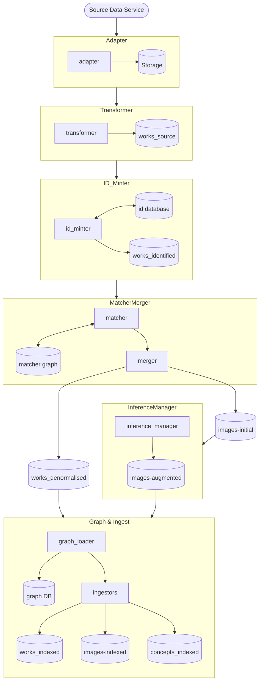

# The pipeline

## The Works pipeline

How this all fits together

```mermaid
flowchart TB
 start([Source Data Service]) --> Adapter
    storage[(Storage)]

    subgraph Adapter
        direction LR
        adapter --> storage
    end

    works_source[(works_source)]
    subgraph Transformer
        direction LR
        transformer --> works_source
    end

    id_database[(id database)]
    works_identified[(works_identified)]
    subgraph ID_Minter
        direction LR
        id_minter <--> id_database
        id_minter --> works_identified
    end

    subgraph MatcherMerger
        direction TB
        matcher <--> matchergraph[(matcher graph)]
        matcher --> merger
    end

    works_denormalised[(works_denormalised)]
    images_initial[(images-initial)]

    images_augmented[(images-augmented)]
    subgraph InferenceManager
        direction LR
        inference_manager --> images_augmented
    end

    subgraph GraphAndIngest["Graph & Ingest"]
        direction TB
        graph_loader --> graph_db[(graph DB)]
        graph_loader --> ingestors
        ingestors --> works_indexed[(works_indexed)]
        ingestors --> images_indexed[(images-indexed)]
        ingestors --> concepts_indexed[(concepts_indexed)]
    end

    Adapter --> Transformer
    Transformer --> ID_Minter
    ID_Minter --> MatcherMerger
    merger --> works_denormalised
    merger --> images_initial
    images_initial --> InferenceManager
    works_denormalised --> GraphAndIngest
    images_augmented --> GraphAndIngest

```

Individual stages:
* [CALM adapter](../calm_adapter/README.md) soon to be replaced by [Axiell adapter](../catalogue_graph/src/adapters/extractors/oai_pmh/README.md)
* [EBSCO adapter](../ebsco_adapter/README.md)
* [METS adapter](../mets_adapter/README.md)
* [SIERRA adapter](../sierra_adapter/README.md) soon to be replaced by [Folio adapter](../catalogue_graph/src/adapters/extractors/oai_pmh/README.md)
* [TEI adapter](../tei_adapter/README.md)
* [transformers](./transformer/)
* [id_minter](../catalogue_graph/src/id_minter/README.md)
* [matcher](./matcher_merger/matcher/README.md)
* [merger](./matcher_merger/merger/README.md)
* [ingestor](../catalogue_graph/src/ingestor/README.md)

