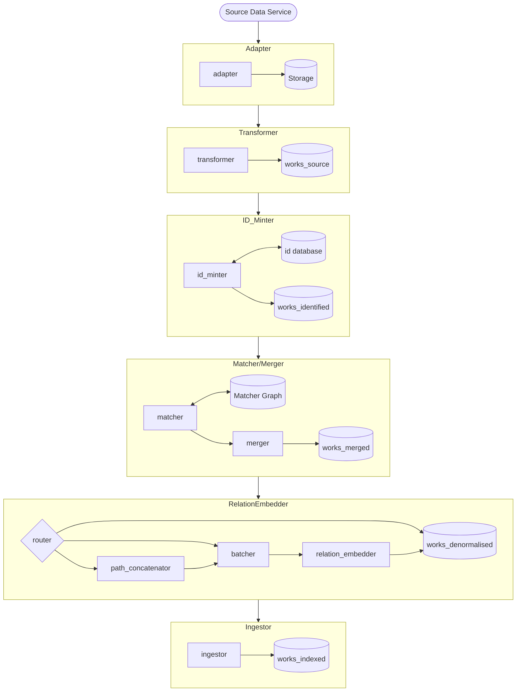

# The pipeline

## The Works pipeline

How this all fits together

```mermaid
flowchart TD
    start([Source Data Service]) --> Adapter
    storage[(Storage)]
    matcher_graph[(Matcher Graph)]
    id_database[(id database)]
    works_source[(works_source)]
    works_identified[(works_identified)]
    works_merged[(works_merged)]
    works_denormalised[(works_denormalised)]
    works_indexed[(works_indexed)]
    router{router}
    subgraph Adapter
        direction LR
        adapter --> storage
    end
    subgraph Transformer
        direction LR
        transformer --> works_source
    end
    subgraph ID_Minter
        direction LR
        id_minter <--> id_database
        id_minter --> works_identified
    end

    subgraph Matcher/Merger
        direction LR
        matcher <--> matcher_graph
        matcher --> merger
        merger --> works_merged
    end

    subgraph RelationEmbedder
        direction LR
        router --> batcher
        router --> path_concatenator
        path_concatenator --> batcher
        router --> works_denormalised
        batcher --> relation_embedder
        relation_embedder --> works_denormalised
    end

    subgraph Ingestor
        direction LR
        ingestor --> works_indexed
    end

    Adapter --> Transformer
    Transformer --> ID_Minter
    ID_Minter --> Matcher/Merger
    Matcher/Merger --> RelationEmbedder
    RelationEmbedder --> Ingestor
```

