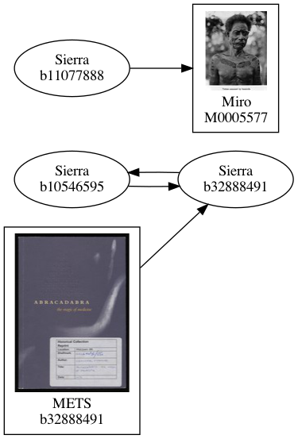

# matcher

Some objects have records in multiple catalogues.
For example, a book might have an entry in Sierra (the library catalogue) and a METS file (for the digitised version).
We want to combine these records into a single work.

The matcher constructs a graph of all the connections between works, which we can use to work out which Works should be merged together.
For example, here's a graph of five works:



Although there are five source records, we can see that these should be combined into two merged works:

*   One work made from Sierra b11077888 and Miro M0005577
*   One work made from Sierra b10546595, Sierra b32888491, and METS b32888491

The links are populated in the transformers – for example, the Sierra transformer will have created a work that says *"Sierra b11077888 should be linked with Miro M0005577"*.
The matcher combines these links into a single graph.


## Debugging the matcher

The visual graphs (like the one above) are useful for debugging the matcher, if somebody asks why two works have (or haven't) been matched together.

To view a matcher graph, use the script in this directory:

```
cd ./scripts
yarn
yarn getMatcherGraph [catalogueId]
```
