# matcher

Some objects have records in multiple catalogues.
For example, a book might have an entry in Sierra (the library catalogue) and a METS file (for the digitised version).
We want to combine these records into a single work.

The matcher constructs a graph of all the connections between works, which we can use to work out which Works should be
merged together.
For example, here's a graph of five works:


Although there are five source records, we can see that these should be combined into two merged works:

* One work made from Sierra b11077888 and Miro M0005577
* One work made from Sierra b10546595, Sierra b32888491, and METS b32888491

The links are populated in the transformers – for example, the Sierra transformer will have created a work that says *"
Sierra b11077888 should be linked with Miro M0005577"*.
The matcher combines these links into a single graph.

The links from the transformers are transitive and may or may not be defined at both ends.
e.g. in the example above Sierra:b10546595 knows nothing of METS:b32888491.  
However, they are still combined into a single graph, regardless of which one
of the three documents is currently being processed.

The list of affected documents is then sent to the [merger](../merger/README.md).
The list's order should not be important (though it may be used as a tiebreaker),
The distinction between target and source records is determined within the merger itself.

## In the pipeline

How this fits into the pipeline.

```mermaid
sequenceDiagram
    participant Upstream Queue
    participant Upstream Index 🗄
    participant Matcher
    participant Graph Store
    Upstream Queue -) Matcher: dunrz35z
    participant Merger
    Matcher ->> Upstream Index 🗄: GET dunrz35z
    Upstream Index 🗄 -->> Matcher: JSON doc dunrz35z, which is derived from Mets:b32888491
    Matcher ->> Matcher: extract mergeCandidates
    Note right of Matcher: dunrz35z(Mets:b32888491) contains mergeCandidate yc7v8r7p(Sierra:b32888491)
    Matcher ->> Graph Store: What else is in the graph for dunrz35z and yc7v8r7p?
    Graph Store -->> Matcher: x5zg9f72(Sierra:b10546595)
    Matcher -) Merger: [dunrz35z, yc7v8r7p, x5zg9f72]

```



## Debugging the matcher

The visual graphs (like the one above) are useful for debugging the matcher, if somebody asks why two works have (or
haven't) been matched together.

To view a matcher graph, use the script in this directory:

```
cd ./scripts
yarn
yarn getMatcherGraph [catalogueId]
```
