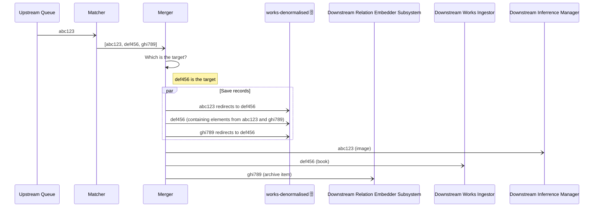

# Merger

## What

Merges records that refer to the same object

See [matcher](../matcher/README.md) for more rationale.

## How

* The [matcher](../matcher/README.md) provides a message containing a list of identifiers
  of "matched" records.
* The merger determines which record is the "target", according to [precedence](
  src/main/scala/weco/pipeline/merger/rules/TargetPrecedence.scala)
* The merger extracts the relevant fields from each record, and merges the values onto the "main" record according to
  the [rules](src/main/scala/weco/pipeline/merger/rules)
* The updated main record is written into the denormalised index.
* Redirect entries for each of the used records are also written into the denormalised index.
* Records are then routed as:
  - Images (-> notify Inferrence Manager)
  - Records with a CollectionPath (-> notify Relation Embedder Subsystem)
  - Records without a CollectionPath (-> notify Works Ingestor)

## In Pictures

How this fits into the pipeline.


```mermaid
sequenceDiagram
    participant Upstream Queue
    participant Matcher
    participant Merger
    participant works-denormalised 🗄
participant Downstream Relation Embedder Subsystem
participant Downstream Works Ingestor
participant Downstream Inferrence Manager

Upstream Queue -) Matcher: abc123
Matcher -) Merger: [abc123, def456, ghi789]
Merger ->> Merger: Which is the target?
Note right of Merger: def456 is the target

par Save records
Merger -) works-denormalised 🗄: abc123 redirects to def456
Merger -) works-denormalised 🗄: def456 (containing elements from abc123 and ghi789)
Merger -) works-denormalised 🗄: ghi789 redirects to def456
end
Merger -) Downstream Inferrence Manager: abc123 (image)
Merger -) Downstream Works Ingestor: def456 (book)
Merger -) Downstream Relation Embedder Subsystem: ghi789 (archive item)
```

## Testing

Most of the merger's behaviour is covered by unit tests, which need nothing
running alongside them.

The matcher and the merger are separate applications, but a lot of what we care
about only happens when the two work together: which records end up matched, and
what the merger then does with them. `MergerIntegrationTest` covers that pair.
It drives both applications through their real Lambda entrypoints and gives the
matcher a real DynamoDB graph table, so the matcher graph builds up from one
work to the next as it does in production. That is what lets the tests say
anything about the order records arrive in, which is where several of our
merging bugs have come from.

Because they use a real graph table, these tests need the containers in
`docker-compose.yml`:

```
docker compose up -d
sbt "project merger" "testOnly weco.pipeline.merger.MergerIntegrationTest"
```

`./builds/run_sbt_tests.sh merger` starts them for you, and that is what CI runs.

The wiring lives in
[`IntegrationTestHelpers`](src/test/scala/weco/pipeline/merger/fixtures/IntegrationTestHelpers.scala),
so the test file itself stays a readable description of what we expect the two
applications to do. If you want to write this kind of test for another pair of
services, that file is the pattern to copy: assemble the real applications over
real storage, share the indices they read from, hand one application's output
straight to the next instead of using a queue, and put a single `processX`
helper in front of it all so the tests read as a sequence of events.
