# Merger

## What

Merges records that refer to the same object

See [matcher](../matcher/README.md) for more rationale.

## How

* The [matcher](../matcher/README.md) provides a message containing a list of identifiers
  of "matched" records.
* The merger determines which record is the "target", according to [precedence](
  src/main/scala/weco/pipeline/merger/rules/TargetPrecedence.scala)
* The merger extracts the relevant fields from each record, and merges the values onto the "main" record according to
  the [rules](src/main/scala/weco/pipeline/merger/rules)
* The updated main record is written into the denormalised index.
* Redirect entries for each of the used records are also written into the denormalised index.
* Records are then routed as:
  - Images (-> notify Inferrence Manager)
  - Records with a CollectionPath (-> notify Relation Embedder Subsystem)
  - Records without a CollectionPath (-> notify Works Ingestor)

## In Pictures

How this fits into the pipeline.

```mermaid
sequenceDiagram
    participant Upstream Queue
    participant Matcher
    participant Merger
    participant works-denormalised 🗄
participant Downstream Relation Embedder Subsystem
participant Downstream Works Ingestor
participant Downstream Inferrence Manager

Upstream Queue -) Matcher: abc123
Matcher -) Merger: [abc123, def456, ghi789]
Merger ->> Merger: Which is the target?
Note right of Merger: def456 is the target

par Save records
Merger -) works-denormalised 🗄: abc123 redirects to def456
Merger -) works-denormalised 🗄: def456 (containing elements from abc123 and ghi789)
Merger -) works-denormalised 🗄: ghi789 redirects to def456
end
Merger -) Downstream Inferrence Manager: abc123 (image)
Merger -) Downstream Works Ingestor: def456 (book)
Merger -) Downstream Relation Embedder Subsystem: ghi789 (archive item)
```

