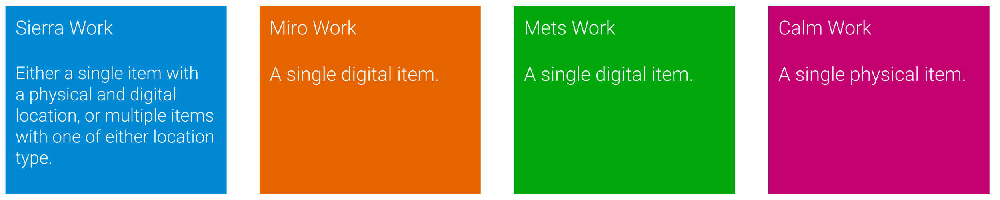

# Merger

Merging rules are applied per field, with a matching rule being applied to a single `target` (a Sierra work) and one or more`sources`.

## Items

The works coming into the merger are as follows:

When there is a single item on the Sierra work, the following rules apply:

  1. If there is a Calm work we merge the physical location from the Calm rather than from Sierra

  2. If there is a METS work we merge the digital location from METS rather than from Sierra

  3. If METS data doesn't exist, we fall back to using digital locations from Miro / other matched Sierra works, and merge these onto the item

When there are multiple items on the Sierra work, the following rules apply:

  1. If there is a Calm work we add the physical item from Calm in addition to the Sierra items

  2. If there is a METS work we add the digital item from METS in addition to the Sierra items

  3. If METS data doesn't exist, we fall back to using digital locations from other matched Sierra works, and add these items in addition to the existing one, but ignore any Miro data
