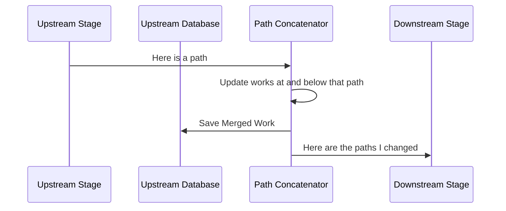
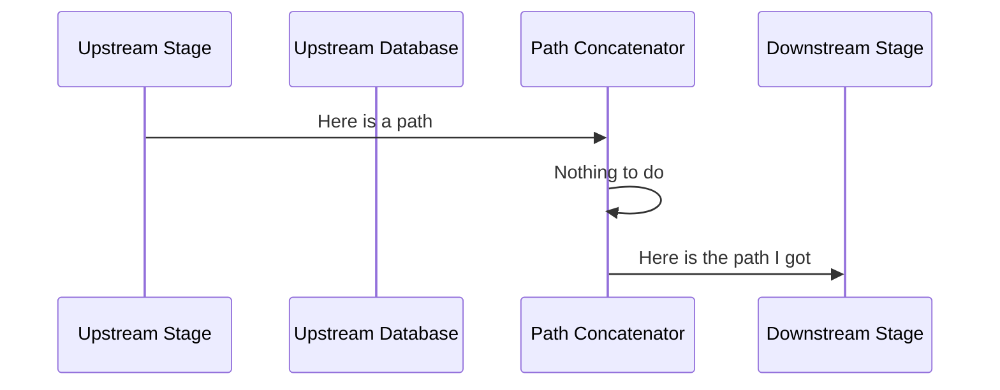
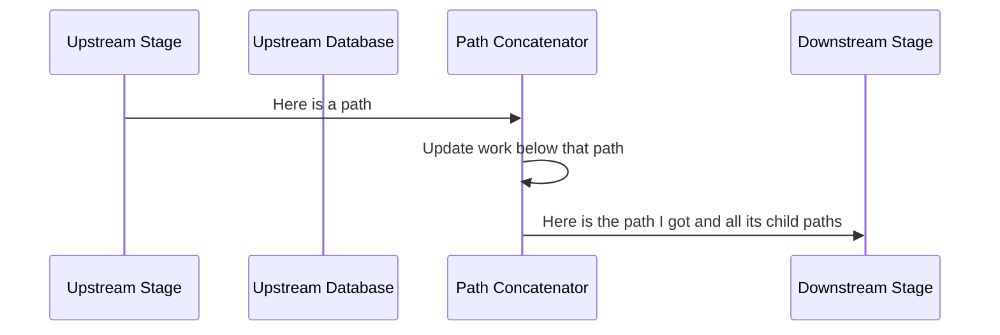

# Path Concatenator

## What?

Unlike records from other systems which each store their full path to the root of their hierarchy,
records from Sierra only know their immediately adjacent parent/child relations.

This makes it impossible to construct a full hierarchical path just from the data in a single record (unless that
record is either the root or a child of the root).

When a Sierra record in a hierarchy is discovered, it uses the path_concatenator to complete its place in the hierarchy
if necessary.

See [RFC 046: Transitive hierarchies in Sierra](https://github.com/wellcomecollection/docs/tree/main/rfcs/046-transitive-sierra-hierarchies)
for more detail.

## How?

1. Take the first and last segments of the path
    * e.g. given a path, `root/branch/leaf` - it will use `root`, and `leaf`.
2. Run a wildcard search for records whose last segment matches the first segment of this record.
    * e.g. `*/root`
    * This should only match, at most, one record, if there are more, log an error and do nothing.
    * If it does not match any records, continue.
3. Replace the first segment in this record with the collectionPath of that record.
    * e.g. this record is `d/e/f`, there exists `b/c/d`, the collectionPath for this record becomes `b/c/d/e/f`
4. Run a term search for records with a collectionPath matching the last segment
    * collectionPath is a path_hierarchy, so in the example above, this will match any records with a path that start with `leaf`
5. Replace the first segment in those collectionPath, with this record's collectionPath
    * e.g. a path `leaf/1/2` would become `root/branch/leaf/1/2`
6. Notify downstream (batcher) of all changed paths.
7. Notify downstream (batcher) of the current path if it is unchanged.

This is a deliberately ordered list of steps, so that the current record *first* gets its own path embellished, *then*
goes on to embellish the paths of its children with that new path.  Updating the child paths with the current record's
path _before_ updating the current record's path would result in the child records having incomplete paths.

### Shortcuts

If the path of a parent does not contain `/`, step 3, above, can be skipped.
If the path of the current record at step 4, above does not contain `/`, skip to step 7.

## Scale

This is expected to run only on...

* those Sierra records that generate a collectionPath,
* of those, it will only be triggered when the path has a `/`
* of those, it will only change records when both a parent and a child have a path with `/`

As such, it is unlikely to run on many records at once, when it does, it is unlikely to 
modify many records at all.

## In Pictures
How this fits into the pipeline.

### When all the steps above cause changes

### When none of the steps above cause changes

### When the given path remains the same, but its children change

