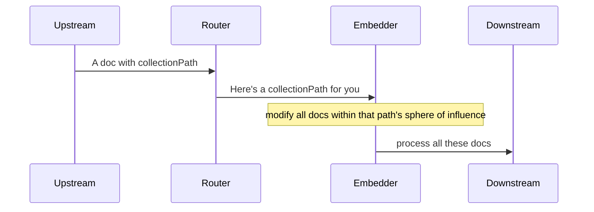
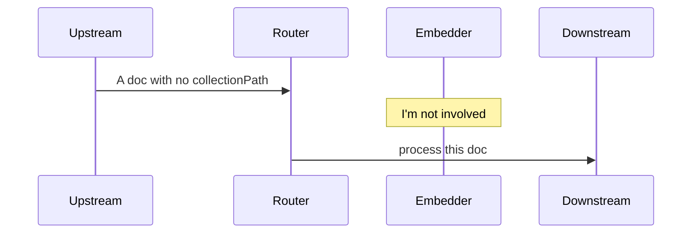

# Relation Embedder Router
## What does it do?

The router extracts any collectionPath values from incoming documents and notifies the embedder that there is a 
collectionPath to process.

If a document has no collectionPath, it is simply passed on to the works topic.

## Why?

Unlike other pipeline stages, the relation embedder does not operate on the document currently 
passing through the pipeline, but on *all* documents with which that document has a relationship.

Because of this, the message sent to the embedder is the *content of the collectionPath*, rather 
than a way to identify the document in question.
