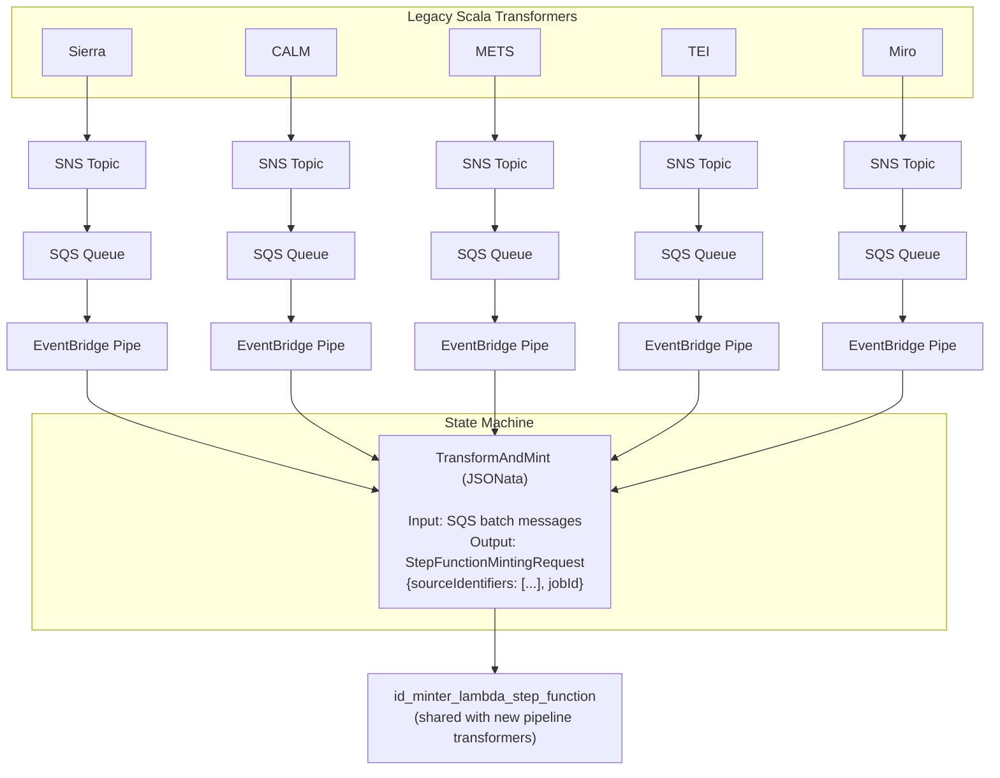

# SQS ID Minter Bridge

This module provides a bridge between the older Scala SQS-based transformers and the new state machine-based pipeline flow.

## Purpose

The legacy Scala transformers (Sierra, CALM, METS, TEI, Miro) publish source identifiers to SNS topics. This module creates infrastructure to consume those messages and route them through the newer Step Functions-based ID minter workflow.

## Architecture



## Message Transformation

The state machine transforms batched SQS messages (containing SNS envelopes) into the format expected by the ID minter Lambda:

**Input** (from EventBridge Pipe):
```json
[
  { "messageId": "...", "body": "{\"Type\":\"Notification\",\"Message\":\"source-id-1\",...}" },
  { "messageId": "...", "body": "{\"Type\":\"Notification\",\"Message\":\"source-id-2\",...}" }
]
```

**Output** (to Lambda):
```json
{
  "sourceIdentifiers": ["source-id-1", "source-id-2"],
  "jobId": "execution-name"
}
```

## Usage

```hcl
module "sqs_id_minter_bridge" {
  source = "../modules/sqs_id_minter_bridge"

  name           = "catalogue-${var.pipeline_date}_sqs_id_minter_bridge"
  sns_topic_arns = [
    module.sierra_transformer_output_topic.arn,
    module.calm_transformer_output_topic.arn,
    module.mets_transformer_output_topic.arn,
    module.tei_transformer_output_topic.arn,
  ]
  lambda_arn = module.id_minter_lambda_step_function.lambda_arn

  batch_size                         = 75
  maximum_batching_window_in_seconds = 60
  queue_visibility_timeout_seconds   = 300
  dlq_alarm_arn                      = var.dlq_alarm_topic_arn
}
```

## Variables

| Name | Description | Type | Default |
|------|-------------|------|---------|
| `name` | Name prefix for all resources | `string` | - |
| `sns_topic_arns` | List of SNS topic ARNs from legacy transformers | `list(string)` | - |
| `lambda_arn` | ARN of the id_minter_lambda_step_function | `string` | - |
| `batch_size` | Max records per batch from SQS | `number` | `10` |
| `maximum_batching_window_in_seconds` | Max time to gather records | `number` | `0` |
| `queue_visibility_timeout_seconds` | SQS visibility timeout | `number` | `300` |
| `dlq_alarm_arn` | SNS topic ARN for DLQ alarms | `string` | `null` |
| `enabled` | Whether the pipes are enabled | `bool` | `true` |

## Outputs

| Name | Description |
|------|-------------|
| `state_machine_arn` | ARN of the state machine |
| `state_machine_role_name` | Name of the state machine IAM role |
| `pipe_arns` | Map of SNS topic ARN to EventBridge Pipe ARN |
| `queue_arns` | Map of SNS topic ARN to SQS queue ARN |
