# reindexer

Normally, the transformation pipeline is triggered when we get an update from the source system/adapter:

<!--
  Generated from Mermaid config (https://mermaid-js.github.io/mermaid/#/ /
  https://mermaid.live)

  graph LR
      S[source system] \-\-> A
      A[adapter] \-\-> T(transformer)

  Note: the double hyphens have been escaped for this HTML comment;
  you'll need to remove them to render the diagram.
-->


The **reindexer** is a second trigger for the transformer: it lets us transform a record even when there hasn't been an update in the source system.

<!--
  Generated from Mermaid config (https://mermaid-js.github.io/mermaid/#/ /
  https://mermaid.live)

  graph LR
      S[source system] \-\-> A
      A[adapter] \-\-> T(transformer)
      R[reindexer] \-\-> T

  Note: the double hyphens have been escaped for this HTML comment;
  you'll need to remove them to render the diagram.
-->



This is useful if, say, we've modified the transformation logic and we want to reapply it to an existing record.

We also use it when we have a new pipeline we want to populate with data.


## Types of reindex

*   A **complete** reindex will re-send all the records for a given source system, e.g. all the Sierra records.
    We use it when we're populating a new pipeline.

*   A **partial** reindex will re-send a small number of records, e.g. 10 CALM records.
    It's useful if you're changing how the pipeline behaves and want to test it still works correctly.

*   A **specific** reindex will re-send records with a given set of IDs.


## Key components

*   The **reindex_worker** is the Scala service that sends notifications to the transformer asking it to re-transform a record.

    It's a standard SQS-backed service: it receives **reindex requests** (e.g. please do a partial reindex of CALM with 10 records), and sends the appropriate downstream notifications (e.g. 10 notifications for the 10 records).

*   The **start reindex script** (`start_reindex.py`) sends a reindex request.
    If you run the script without any arguments, it prompts you for what sort of reindex you want to run.


## Connecting a pipeline to the reindexer

By default, transformers aren't connected to a reindexer.

<!--
  Generated from Mermaid config (https://mermaid-js.github.io/mermaid/#/ /
  https://mermaid.live)

  graph LR
      R[reindexer] -.-> T1(existing pipeline/transformer)
      R[reindexer] -\-> T2(new pipeline/transformer)

  Note: the double hyphens have been escaped for this HTML comment;
  you'll need to remove them to render the diagram.
-->

When we create a new, empty pipeline, we connect the reindexer so we can do a complete reindex and populate the pipeline.
Once that reindex is done, we disconnect the pipeline.



This is so that when we create the next pipeline and do a complete reindex into that, we don't re-send every record in the already existing pipeline.
This reduces unnecessary processing in that pipeline.

You can connect a pipeline to a reindexer, by modifying the [pipeline Terraform config](https://github.com/wellcomecollection/catalogue-pipeline/tree/main/pipeline/terraform).
Specifically, you set `reindexing_state.connect_reindex_topics = true` on the pipeline that you want the reindexer to update.

## Fixing leaks

Sometimes you might find that works go missing in between pipeline stages - there end up being fewer documents in the index after a stage than in the one before it. We have a couple of scripts to help fix this:

- Use `pipeline_storage_diff.py <pipeline_date> --from <from_index> --to <to_index> <output_file>` to get a list of IDs in the `<pipeline_date>` pipeline that are not in both `<from_index>` and `<to_index>`, and write the list to `<out_file>`.
- Then use `pipeline_inject_messages.py <pipeline_date> <destination_name> <ids_file>` to use the `<ids_file>` output by the previous command and inject those IDs into the _topic_ named `<destination_name>` in the `<pipeline_date>` pipeline.

So for example, if in the `2022-02-22` pipeline you had messages go missing in the relation embedder, you might do the following:

```
./pipeline_storage_diff.py 2022-02-22 --from works-merged --to works-denormalised ./missing-ids.csv
./pipeline_inject_messages.py 2022-02-22 merger_works_output ./missing-ids.csv
```

## Reingesting for display

Changes in the display model require that documents are reingested: not a complete reindex, but a reindex of visible works/images only, through the final stage of the pipeline.

We can do this with `reingest_for_display.py`:

```
./reingest_for_display.py 2022-02-22 --type works
```

or if we just wanted to reingest a single document first to test:

```
./reingest_for_display.py 2022-02-22 --type images --test-doc-id abcd1234
```
