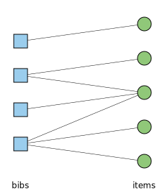
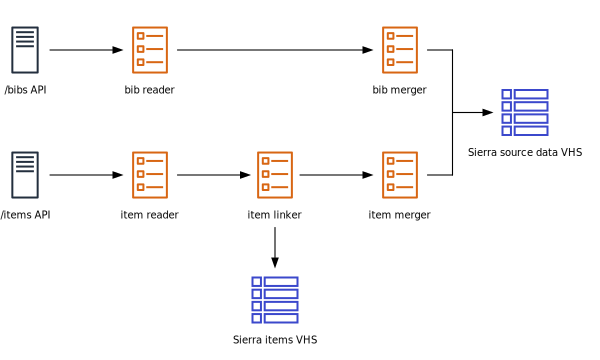

# Sierra adapter

This is the adapter for [Sierra][sierra], the library management system.

This stack is responsible for reading records from Sierra and copying them into the pipeline.
Since Sierra records can be edited at any time, it is also responsible for keeping the pipeline up-to-date with new edits or additions.

See also:

-   [Notes on Sierra IDs](https://github.com/wellcomecollection/catalogue/blob/main/docs/sierra/sierra_ids.md)
-   [Fetching records from Sierra](https://github.com/wellcomecollection/catalogue/blob/main/docs/adapters/fetching_records_from_sierra.md)

[sierra]: https://www.iii.com/products/sierra-ils/


## Shape of the Sierra data

The Sierra API contains multiple types of record.
These are the records we're especially interested in:

*   A *bib* is a *bibliographic record* – for example, an individual book.
    It's the "concept" of the book, rather than an individual copy.
*   An *item* is a retrievable object – for example, a physical copy of a book, or an electronic book that you can download.
*   A *holdings* is an object that is published in multiple parts – for example, the issues of a journal.
    Sometimes a holdings record is broken down into individual items.
*   An *order* is a placeholder record that describes something which has been ordered but not yet received.
    These are usually replaced by item records when the item is received, but the order record isn't always deleted.

There is a many-to-many mapping between bibs and items:

*   A single bib can be associated with multiple items: for example, we might have multiple physical copies (the items) of a book (the bib).

*   A single item can be associated with multiple bibs.
    There are two cases where this can happen:

    -   "boundwith": items such as pamphlets or patents which are bound together, where there are bib records for individual pieces but not for the whole volume.
        For example, i15699833 is a single physical item (a bound volume of patents), and each of the individual patents has its own bib number.

    -   "contained in": this is how the ephemera is organised.
        You have a single box (an item) of ephemera, and then a bib record both for the box as a whole, and individual big records for the pieces of ephemera it contains – for example, i14702228.

    In both cases, there's a single item record because the physical objects have to be produced together.
    You can't make an individual order for a single pamphlet or ephemera object.




## What do we need for a Work?

The adapter needs to provide enough data for the Sierra transformer to create a Work for the catalogue API.
To create a Work from the Sierra data, we need a single bib and all the items, holdings, and orders it is associated with.


In our ontology:

*   A bib maps to a "Work"
*   An item maps to an identified "Item"
*   A holdings maps to a "Holdings"
*   An order maps to an unidentified "Item"


## Shape of the Sierra API

The Sierra API requires you to query for different types of record separately.

Bibs are standalone entities, and do not refer to other records.

Items, holdings, and orders have a reference to the bibs they are associated with:

```http
GET /sierra-api/items?id=1569983
{
  "entries": [
    {
      "bibIds": ["1645864", "1645873", "1645880"],
      "id": "1569983",
      ...
    }
  ],
  "total": 1
}
```

You cannot ask the API "get me a single bib and all the items associated with it" -- we have to join those together manually.


## Getting credentials for the Sierra API

At time of writing (7 June 2021), the API credentials for the Sierra adapter are owned by <wellcomedigitalplatform@wellcome.ac.uk>.
To create new credentials, or to revoke an existing API key:

1. Log in to Sierra API console (you need an admin account; contact Library Systems Support)
2. Select "Sierra API keys"
3. Create a new key with the `bibs read`, `items read`, `holdings read` and `orders read` permissions


## Using the Sierra API

You can read the Sierra API docs at <https://techdocs.iii.com/sierraapi/Content/zReference/resources.htm>.

The API allows you to query for `/bibs` or `/items`.
Among other things, you can filter for:

-   A specific ID: `/items?id=1569983` (note: this is the seven-digit ID)
-   Records which have been deleted: `/bibs?deleted=true`
-   Records which were updated in a particular timeframe: `/bibs?updatedDate=[2013-09-03T13:17:45Z,2013-09-03T13:37:45Z]`

You have to tell the API which fields you want to return: by default, it won't return a full set.
For example, calling `/items?fields=updatedDate,location,status` will only return the `updatedDate`, `location` and status `fields`.

If you'd like to experiment with the Sierra API, you can use the Python client below.

<details>
<summary>Python client for the Sierra API</summary>

This requires Python 3.6+ and the requests library.

```python
#!/usr/bin/env python

import json

import requests


API_URL = "https://libsys.wellcomelibrary.org/iii/sierra-api/v3"


class HeadersAuth(requests.auth.AuthBase):
    """
    Auth wrapper that adds a set of headers to every outgoing request.

    See https://2.python-requests.org/en/master/user/authentication/#new-forms-of-authentication
    """
    def __init__(self, headers):
        self.headers = headers

    def __call__(self, req):
        req.headers.update(self.headers)
        return req


def get_session(oauth_key, oauth_secret):
    """
    Get an instance of requests.Session() that is authenticated with
    the SIerra API.
    """
    sess = requests.Session()

    # Get an access token
    # https://sandbox.iii.com/docs/Content/zReference/authClient.htm
    token_url = API_URL + "/token"
    token_resp = sess.post(token_url, auth=(oauth_key, oauth_secret))
    token_resp.raise_for_status()
    access_token = token_resp.json()["access_token"]

    # https://sandbox.iii.com/docs/Content/zReference/authClient.htm
    # https://sandbox.iii.com/docs/Content/zReference/operations.htm#XML,
    headers = {
        "Authorization": f"Bearer {access_token}",
        "Accept": "application/json",
    }

    sess.auth = HeadersAuth(headers=headers)

    return sess


if __name__ == "__main__":
    sess = get_session(
        oauth_key="<OAUTH_KEY>",
        oauth_secret="<OAUTH_SECRET>"
    )

    resp = sess.get(API_URL + "/bibs", params={"id": "1645873"})
    print(json.dumps(resp.json(), indent=2, sort_keys=True))
```

</details>

The adapter accesses the Sierra API through a Scala library we've written: [sierra-streams-source](https://github.com/wellcometrust/sierra-streams-source).


## How the adapter uses the Sierra API

The Sierra API has over two million records.
We don't want to fetch them all repeatedly – that would cause unnecessary load on the API servers, and needless churn (and cost) in the pipeline.

Instead, we use the ability to request records which were updated within a particular timeframe.
Every 15 minutes, we ask the API for a 30 minute *"window"* of updated records.


This gives us a stream of updated records from the API.
Because the windows overlap, we will eventually process every update to Sierra.

If you need to get all the records, you can do so for asking for every window back to the installation of Sierra: request every update after **1 January 1999**.


## How updates are scheduled

Every 15 minutes, we want to poll the API for a 30 minute window of update records.
How is that work scheduled?


We run the following steps:

1.  We have a timed CloudWatch event that fires every 15 minutes.
    The event triggers a Lambda function (`sierra_window_generator`).

2.  When the Lambda function wakes up, it gets the current time, and 30 minutes ago, and puts those times in a JSON blob:

    ```json
    {
      "start": "2020-01-15T11:30:00+00:00",
      "end":   "2020-01-15T12:00:00+00:00",
    }
    ```

3.  The Lambda sends that JSON to an SNS topic of "windows that need to be processed", where it can be picked up by the rest of the adapter pipeline.

We run two copies of this scheduler: one for bibs, one for items.

Information about the windows that have been processed successfully is written into an S3 bucket (`wellcomecollection-platform-adapter-sierra`).
If you look in `windows_bibs_complete` or `windows_items_complete`, you can see the windows that the adapter has successfully processed – and if there are any missing gaps.


## How the adapter stores/processes data

This is the architecture of the adapter:



We have the Sierra API on the left, and eventually we end up with a Sierra source data record in the VHS on the right.
(The VHS is a data store used by the pipeline.)

A "source data record" is a bib with all its associated items – the necessary pieces for a catalogue Work.
It's a serialisation of the `SierraTransformable` model:

```scala
case class SierraTransformable(
  sierraId: SierraBibNumber,
  maybeBibRecord: Option[SierraBibRecord],
  itemRecords: Map[SierraItemNumber, SierraItemRecord]
)
```

Let's go through the bibs and items process separately.

Bibs:

1.  The **bib reader** (an ECS task) picks up a window from the window generator, and asks the Sierra API for every updated bib in that window/timeframe.
    It writes the Sierra responses to an S3 bucket, so they are saved as quickly as possible.

2.  The **S3 demultiplexer** (a Lambda function, not pictured) gets an S3 notification telling it about the file written to the bucket by the bib reader.
    It opens the file, parses out the individual records, and sends an SNS notification for every modified bib record.

3.  The **bib merger** (an ECS task) gets the messages sent by the S3 demultiplexer.
    It looks in the source data VHS, and compares the currently stored bib record (if any) with the update from Sierra:

    -   If there's *no* existing bib record, the merger writes the new record to the VHS
    -   If the existing bib record is *older* (according to the `modifiedDate` field in Sierra), then the merger replaces the existing record with the record it's just received
    -   If the existing bib record is *newer*, then the merger drops the record it's just received

4.  The bib merger sends an SNS notification to tell the rest of the pipeline that a new Sierra record is available.

Items, orders and holdings have some extra steps:

1.  The **item reader** (an ECS task) and **S3 demultiplexer** work as for bibs, but querying the Sierra API for items, not bibs.

2.  An item in the Sierra API tells us which bibs it is attached to, but it only tells us the bibs it is *currently* attached to.

    Consider the following scenario:

    -   We fetch an item from the API.
        It is associated with bibs `b1`, `b2` and `b3`.
        The pipeline creates three Works associated with this item.
    -   Somebody unlinks the item from bib `b1` in Sierra.
    -   We fetch an updated version of the item from the API.
        It is only associated with bibs `b2` and `b3`.

    We need to remove the item from the Work created from bib `b1`, but the API data doesn't tell us we need to do that – so we need to track the history of item/bib associations ourselves.

    The **item linker** app (an ECS task) records the item–bib associations in a VHS.
    When it gets an updated item, it can compare between the new item and the item in the items-to-dynamo VHS, and see if any bibs have been removed from the item.

    It sends an SNS notification for every item–bib association.
    It sends a notification for both existing and now-deleted associations.

    In the scenario above, it would send three messages:

    <table>
      <tr><th>item</th><th>bib</th><th>deleted?</th></tr>
      <tr><td>i1</td><td>b1</td><td>true</td></tr>
      <tr><td>i1</td><td>b2</td><td>false</td></tr>
      <tr><td>i1</td><td>b3</td><td>false</td></tr>
    </table>

3.  The **item merger** (an ECS task) gets the item/bib notifications from the items-to-dynamo app.

    It looks up the corresponding record in the source data VHS.
    As with the bib merger, it compares the existing record with the item/bib record it's just received, and decides whether to update/delete the source data table, or drop the update it's received as stale.

4.  The item merger sends an SNS notification to tell the rest of the pipeline that a new Sierra record is available.

There's a similar reader/linker/merger pipeline for holdings and orders.


## How the adapter uses the reporting cluster

-   The Sierra adapter stores a copy of all its records in the reporting cluster.

    There are indexes for each type of record (bib/item/holdings/order) which record the top-level information for each record, then separate indexes for fixed-length fields and variable-length fields.
    This allows you to slice across records: e.g. fetching every instance of varfield 856 from bibs, but nothing else.

-   The Sierra adapter queries the holdings data to find electronic holdings that are under embargo, and which need to be repolled on a schedule.
    See the `update_embargoed_holdings` Lambda for more information.
