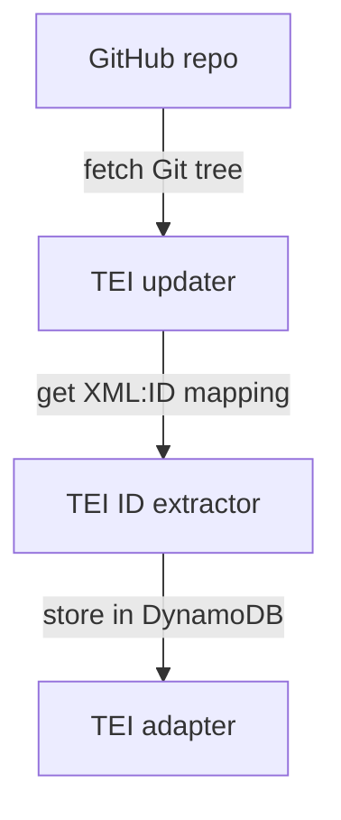

# tei_adapter

This adapter fetches TEI XML files from the [TEI GitHub repository][repo], and copies them to a DynamoDB table.

[repo]: https://github.com/wellcomecollection/wellcome-collection-tei

## How it works

1.  The **TEI updater** fetches the latest Git tree using the GitHub API.

    This describes all the files in the Git repository, and lets us work out which ones have changed.
    It compares to a stored tree in S3, and sends notifications about paths that have changed.

    It polls the tree on a fixed interval, rather than getting a notification when there's a new push to the Git repo.

2.  The **TEI ID extractor** finds the ID in each XML file, and records it in DynamoDB.

    These IDs are more stable than the paths, and will survive e.g. a reorganisation of the folders.

3.  The **TEI adapter** stores each XML file under its ID in a DynamoDB/S3 hybrid store.
